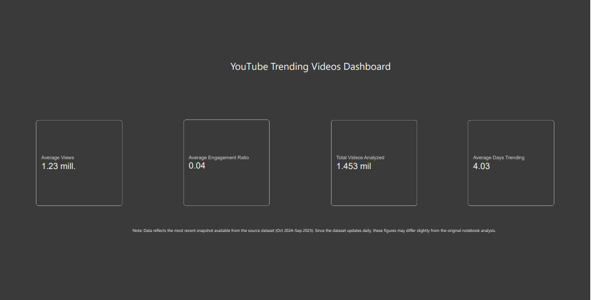
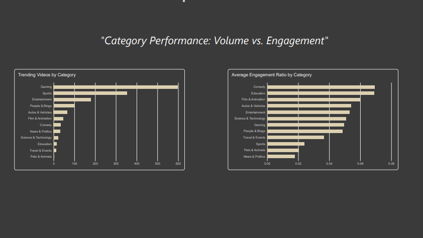
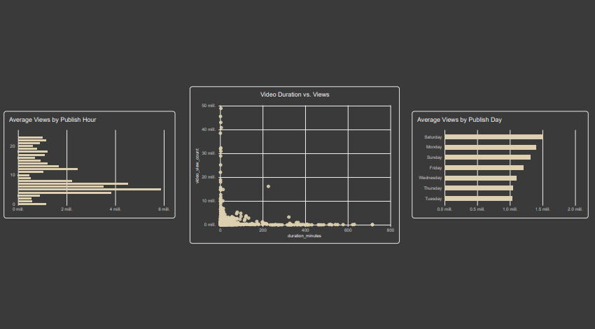
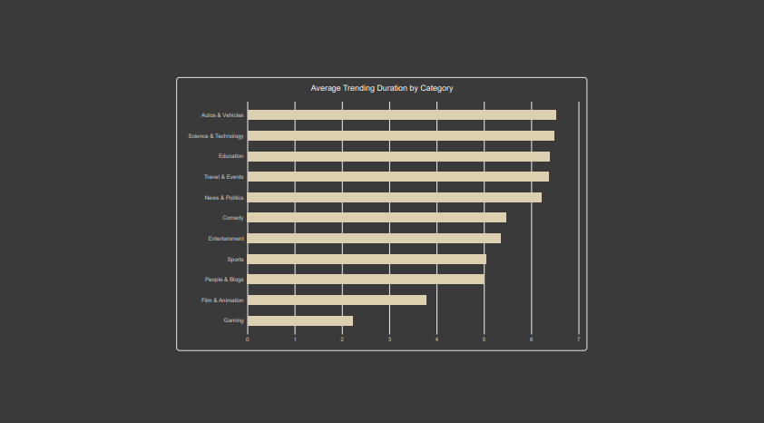

# YouTube Trending Videos Analysis

An exploratory data analysis of YouTube trending videos in the United States, 
identifying content characteristics associated with reaching and staying on 
the trending list.

## Objective

This project analyzes YouTube trending videos in the United States to identify 
which content characteristics — category, title style, publishing timing, 
video duration — are associated with videos reaching and staying in the 
trending list. The goal is to provide actionable insights for someone starting 
a new YouTube channel from scratch.

## Dataset

Data sourced from Kaggle: [YouTube Trending Videos Dataset](https://www.kaggle.com/datasets/keshavbansal95/youtube-trending-videos-dataset), 
covering trending videos across multiple countries from 2024-2025. This 
analysis focuses specifically on the United States market.

## Methodology

1. Filtered the dataset to US trending videos, excluding music content.
2. Removed duplicate entries, keeping each video's first trending appearance.
3. Cleaned missing values in engagement and tag data.
4. Engineered features: tag count, title length, publish hour/day, engagement 
   ratio, video duration, and days spent trending.
5. Conducted exploratory analysis on category performance, correlations 
   between video characteristics and success, publishing timing, and common 
   title patterns.
6. Performed a secondary analysis on trending duration, using all trending 
   appearances (not just first occurrence) to measure how long videos stayed 
   trending.

## Key Findings

- Comedy and Film & Animation categories show higher relative engagement than 
  Gaming and Sports, despite lower video volume.
- Video duration, tag count, and title length are not strong determining 
  factors for whether a video reaches trending — their correlations with 
  views/engagement were nearly null.
- Rather than aiming for clever or ambiguous titles, it's more effective to 
  clearly communicate what the video is about right in the title.
- Hour 18 (6 PM UTC) showed the best balance between upload volume and 
  average views.
- Comedy and Film & Animation are less saturated than Gaming and show a solid 
  percentage of trending duration, making them a stronger starting point for 
  a new channel.

## Tools Used

- Python (pandas, matplotlib, NLTK)
- Google Colab
- Kaggle API (kagglehub)

## How to Run

1. Open the notebook in Google Colab.
2. Run the setup cell to install required packages.
3. The notebook will download the dataset automatically via kagglehub 
   (requires a free Kaggle account).
4. Run all cells in order.

## Limitations

- Analysis excludes music content, as it follows different success patterns 
  not relevant to a content creator starting from scratch.
- The dataset does not include watch time or retention data — engagement is 
  measured as (likes + comments) / views.
- Findings represent correlational patterns, not causal relationships or 
  guarantees of success.
- The dataset only includes videos that already reached trending. Since 
  there's no comparison group of videos that failed to reach trending, the 
  characteristics identified are correlated with success but cannot be 
  proven to cause it.
- This analysis is limited to the US market. While the US is often seen as a 
  reference market for content trends, these patterns may not apply equally 
  to audiences from other languages or cultures.

  ## Power BI Dashboard

An interactive dashboard was built in Power BI to complement the notebook 
analysis, using the same cleaned dataset with an updated data snapshot (the 
source dataset refreshes daily).

### Overview
KPI summary: total videos analyzed, average views, average engagement ratio, 
and average trending duration.

### Category Analysis
Volume of trending videos vs. average engagement ratio by category.

### Timing & Format
Average views by publish hour and day, and the relationship between video 
duration and views.

### Trending Duration
Average number of days videos stay on the trending list, by category.

Full dashboard PDF available in [`dashboard/`](dashboard/).
